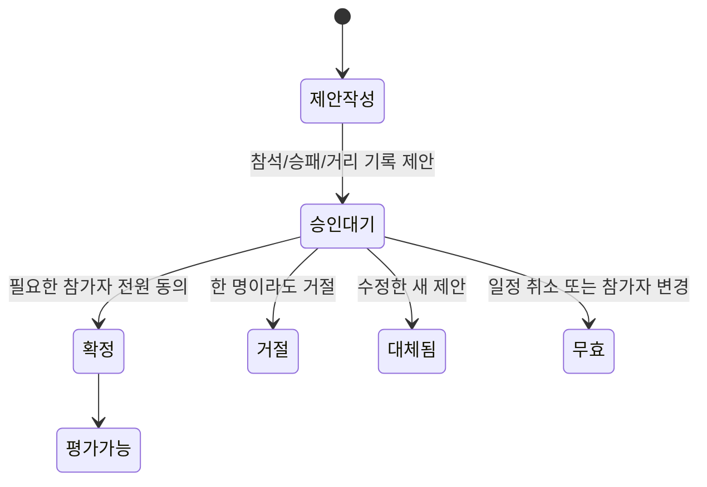

# DWNC 채팅 · 약속 합의 · 기록 확정 · 매너 별점 설계

작성일: 2026-10-03 / T26. 상태: 사용자 승인 후 구현 기준. 최신 검증 결과는 루트 HANDOFF.md와 CURRENT-STATE.md를 따른다.

## 목표와 사용자 결정

커뮤니티에서 매칭 상대·친구·그룹과 대화하고, 함께 정한 시간과 장소를 내 운동 일정에 넣는다. 운동 뒤 한 사람이 승패 또는 운동 기록을 제안하면 상대의 승인 후에만 기록으로 확정하고, 함께 운동한 상대를 1~5점으로 평가한다. 공개 프로필은 매너를 5개의 별과 실제 평가 평균·건수로 보여준다.

사용자는 그룹 결과도 **참석자 전원 승인**을 선택했다. 기존 라이트 글래스, 콩 v3, PC에서도 최대 390px의 모바일 화면, 홈/매칭/랭킹/커뮤니티 하단 메뉴를 유지한다. 팀원이 다른 브랜치에서 제작 중인 SNS 운동 공유카드는 확정 기록용 데이터 계약으로 연결한다.

1시간은 핵심 MVP 구현의 목표이며 검증까지 포함한 완료 보장이 아니다. 초기 구현은 로컬 허구 계정과 SQLite에 한정한다. 기존 DB·74개 디자인 시안·실행 중인 서버를 보존하고, submit-before 및 다른 팀원 브랜치는 다루지 않는다. 신규 기능 커밋·푸시·배포·실계정·외부 DB 연결은 이번 설계의 작업에 포함하지 않는다.

## 접근법 비교와 추천

| 접근 | 포함하는 것 | 비용과 한계 |
|---|---|---|
| 추천: 기존 서버/SQLite 확장 | 저장되는 텍스트 채팅, 대화 화면에서 주기적 조회, 시간/장소 제안과 전원 승인, 기록 승인, 매너 별점, 지도 링크, 공유 데이터 계약 | 새 외부 서비스 없이 검증 가능. 즉시 푸시·지도 내부 검색·분쟁 처리는 이후 작업 |
| 전체 실시간 서비스 | WebSocket/푸시, 지도 SDK·주소 검색·좌표/거리 매칭, 채팅 운영 기능 | 인증·전송·외부 설정·권한·기기 검증이 늘어 1시간 목표에 적합하지 않음 |
| UI 시연만 | 저장되지 않는 채팅과 승인 화면 | 재접속·두 계정·실제 합의를 검증할 수 없어 사용자 목적을 충족하지 못함 |

추천안은 기존 도메인 흐름을 실제로 연결하는 MVP다. 반경 기반 매칭·현위치 수집·앱 내부 지도는 후속 단계로 남긴다. 장소명과 주소, 지도 열기 링크는 최초 범위에 포함한다.

## 현재 코드에서 재사용할 경계

- `backend/commands.js`: 세션에서 행위자 결정, strict 입력 스키마, 전역 revision, 동일 requestId 재시도 영수증, 개인정보 projection.
- `backend/database.js`: JSON 도메인 객체와 관계형 참가/평가 데이터, BEGIN IMMEDIATE 트랜잭션. 현재 마이그레이션 실행기는 001이 존재하면 끝나므로 순차 마이그레이션 지원이 필요하다.
- `dwnc-app/extended-domain.js`: 친구/그룹/매칭/참석 결과/평가 규칙. 현재 result.save는 즉시 확정하므로 제안 단계로 전환해야 한다.
- `dwnc-app/domain.js`, `kong-profile.js`, `service-model.js`: results를 확정 기록으로 읽는다. 승인 대기 데이터를 이 배열에 넣지 않으면 콩·승률·랭킹·기록을 함께 보호할 수 있다.
- `dwnc-app/passport-view.js`: 공개 신분증에 별점 요약을 추가할 위치. 기존 mannerFor는 가상 5건을 가중하므로 새 표시에는 실제 평가 평균과 건수가 필요하다.
- `dwnc-app/cards.js`: 기존 프로필/오늘 일정 PNG를 보존한다. 오늘 일정은 확정 운동 결과와 다르므로 신규 결과 공유카드의 입력으로 그대로 쓰지 않는다.

## 화면과 대화방

커뮤니티 상단 탭은 **친구 / 그룹 / 채팅**으로 구성한다. 채팅 탭은 최근 대화 목록과 대화 화면을 제공한다. 친구 행, 확정 매칭 상세, 그룹 상세에서도 해당 대화를 연다. 아래 하단 메뉴는 기존 4개다.

방 유형과 접근 규칙:

| 유형 | 대화하는 사람 | 방의 식별 기준 |
|---|---|---|
| 친구 1:1 | 서로 수락한 친구 두 명 | 정렬한 두 사용자 ID의 고유 조합 |
| 매칭 | 해당 운동의 모집자와 수락된 확정 참가자 | matchId당 한 방 |
| 그룹 | 현재 그룹 회원 | groupId당 한 방 |

첫 MVP의 매칭 채팅은 확정 참가자용이다. 신청 전 문의·거절된 신청자 채팅은 범위에 넣지 않는다. 그룹은 기존 자유 가입 정책을 유지하며, 그룹 채팅은 현재 회원이 볼 수 있는 대화임을 안내한다. 방은 필요한 시점에 생성하며 반복 열기로 중복 생성하지 않는다.

메시지는 1~1000자의 텍스트로 제한하고 HTML을 escape한다. 첫 MVP는 첨부·음성·메시지 수정/삭제·읽음 영수증·외부 푸시를 포함하지 않는다. 처음에는 최근 100개를 불러오고 cursor로 이전/새 메시지를 조회한다. 대화가 열린 동안 약 4초마다 새 메시지만 가져오며 탭이 숨겨지거나 방/계정이 바뀌면 조회를 중지한다. 입력·포커스·스크롤·제안 작성 중 초안이 유지되어야 한다.

## 시간과 장소를 함께 정하는 약속

대화의 **약속 잡기**에서 종목·참가자·날짜·시작/종료 시간·지역·장소명·주소를 제안한다. 시간은 한국 시간으로 표시하고 기존 날짜/종료/종목 규칙을 검증한다. 장소명과 지역은 필수, 주소는 선택이다.

- 친구 약속은 방의 두 사람을 참가자로 고정한다.
- 그룹 약속은 제안자가 현재 회원 중 함께할 사람을 선택한다. 제안자를 포함하며, 테니스는 2명=단식/4명=복식, 풋살은 2~12명=팀 경기, 러닝은 2~20명=크루로 형식과 정원을 설정한다. 테니스 3명 등 잘못된 조합은 제안 생성 전에 막는다. 그룹 전체가 모든 약속에 자동 참여하지 않는다.
- 매칭 방에서 시간/장소를 다시 합의하면 기존 운동 일정을 갱신한다. 참가자는 그 운동의 확정 참가자 전체로 고정하며 새 중복 운동을 만들지 않는다. 결과가 이미 확정된 운동은 일정 변경을 받지 않는다.

제안자는 자신의 제안에 동의한 상태로 시작한다. 상대는 **동의 / 변경 제안 / 거절**할 수 있다. 변경 제안은 원본을 덮어쓰지 않고 새 버전을 만들며, 기존 버전의 동의는 모두 초기화한다. 날짜·시간·장소·참가자·공개 범위가 동일한 버전에 대해 필요한 사람이 모두 동의한 경우에만 확정한다.

친구/그룹의 새 약속은 마지막 승인 트랜잭션에서 기존 match와 accepted 참가 데이터로 한 번만 변환한다. 친구 약속은 정해진 두 참가자에게만 상세가 보이는 약속이고, 그룹 약속은 그룹 공개다. 기존 friends 공개는 모든 친구에게 열릴 수 있으므로 1:1 약속에는 서버가 관리하는 participantOnly 플래그를 추가하고 일반 공개 판정보다 먼저 참가 권한을 검사한다. DB의 기존 visibility 값은 유지하되 UI에는 '참가자만'으로 표시한다. 새 합의 약속은 선택한 참가자로 닫고 추가 모집을 허용하지 않아 합의되지 않은 사람이 나중에 자동 참여하지 않는다.

확정 순간 모든 참가자의 기존 확정 일정과 겹침을 서버에서 검사한다. 기존 일정을 변경하는 경우 그 원래 matchId는 겹침 검사에서 제외한다. 충돌이나 지난 시작 시각이면 확정하지 않고 변경 제안을 안내한다. 일정이 변경되면 기존 대기 신청·대기 초대는 만료시키고 변경된 시간/장소를 확인한 새 신청을 받는다. 변경 전 신청이 새 조건에 자동 수락되면 안 된다. 취소·참가 철회·원래 일정/참가자 변경은 대기 제안을 무효화한다. 마지막 승인 중복/재전송으로 일정이 두 개 만들어지면 안 된다.

## 기록 제안과 확정



종목 입력은 기존 테니스 스코어/팀·풋살 스코어/MVP/포지션·러닝 거리/페이스/후기·미성립 규칙을 재사용한다. 제안자는 확정 일정 참가자이며 실제 참석자에도 포함되어야 한다.

승인 대상은 **제안 시점에 확정된 일정 참가자 목록**을 고정해 사용한다. 제안자가 참석 목록에서 상대를 빼서 승인을 생략할 수 없다. 불참으로 표시된 참가자도 자기 참석 여부를 확인한다. 이는 사용자가 선택한 전원 승인 기준을 안전하게 적용하는 방식이다. 그룹 가입자가 나중에 늘어도 이 목록은 늘어나지 않는다.

1:1 운동은 제안자 외 한 명, 그룹/복식/함께한 운동은 고정 참가자 전원이 승인한다. 기존 러닝 모집은 정원이 2명 이상이더라도 실제 수락 참가자는 모집자 한 명일 수 있으므로 그 기존 개인 러닝 기록은 바로 확정할 수 있다. 정원 1명 모집이나 1명짜리 채팅 약속을 새로 만들지 않는다. 합의된 채팅 약속의 승인 대상은 생성 시점의 참가자로 고정하며, 원래 여러 명인 일정에서 참석 기록만 한 명으로 줄여 개인 기록 예외를 쓸 수 없다.

제안은 별도 resultProposals에 보관한다. 마지막 승인 전에는 results 삽입, 운동 완료 처리, 콩 성장, 승률/랭킹 반영, 별점 평가, 결과 공유 입력이 모두 발생하지 않는다. 대기 UI에 **2/4명 승인**처럼 진행 상황을 표시한다.

마지막 승인은 같은 트랜잭션에서 원래 참가자·일정·제안 버전을 다시 검증하고 기존 종목 결과로 확정한다. 한 운동의 확정 결과는 하나다. 제안을 수정하면 새 버전에서 다시 승인한다. 이미 확정된 기록의 수정/분쟁 해결은 MVP에서 제공하지 않고, 반려된 제안은 새 기록 제안을 만들 수 있다. 자동 승인이나 시간 경과에 따른 확정은 없다.

기존 result.save 경로도 새 제안 규칙을 거치게 하여 옛 화면/직접 API 호출이 상호 승인을 우회하지 못하도록 한다. 기존 기록은 이미 확정된 기록으로 보존하며 승인자·확정 시각을 새로 꾸며 넣지 않는다. 새 승인 기록만 confirmation 메타데이터를 추가한다.

기존 풋살 데이터는 한 팀의 참가자들이 같은 팀 결과를 공유한다. 이 표현은 유지하며 양 팀을 별도로 모집/배정하는 경기 모델 변경은 포함하지 않는다. 기존 해커톤의 종료 전 결과 입력 허용 규칙도 이번에는 변경하지 않는다.

## 매너 별점

확정 결과에서 실제 함께 참석한 다른 참가자에게만 1~5 정수 별점을 남긴다. 자기 평가, 불참자 평가, 승인 대기 기록 평가, 같은 운동에서 같은 상대에게 두 번 평가는 서버와 DB에서 막는다.

프로필 표시 예: **★★★★☆ 4.2 / 5 · 12건**. 실제 평균에 맞춰 별을 부분 채움하고 숫자와 건수를 텍스트로 제공한다. 평가가 없으면 비어 있는 별과 **아직 평가가 없어요**를 표시한다. 기존 가상 기본 점수/가중 5건을 평가 건수로 취급하지 않는다.

서버는 공개용 `{ average: number | null, count: number }` 요약을 만든다. 다른 사람의 개별 평가자·점수 원본은 내려보내지 않는다. 기존 평가 행은 보존하고 합산하며, 내가 남긴 평가는 기존 권한 범위에서 유지한다. 별점 작성은 확정 결과 상세와 대화의 확정 기록 카드에서 연다. 별을 탭하면 점수만 선택하고 '평가 남기기' 버튼으로 명시적으로 제출한다. 제출 중 중복 클릭을 막고 성공하면 '평가 완료'와 내가 남긴 점수를 표시한다. 제출 실패는 선택을 유지한다.

## 지도와 이후 위치 매칭

최초 범위는 장소명/주소를 저장하고 **지도 열기** 링크를 만든다. Google Maps 검색 URL은 API 키가 필요 없고 장소 질의를 URL 인코딩해 브라우저/지도 앱에서 열 수 있다. 근거: https://developers.google.com/maps/documentation/urls/get-started

지도 검색이나 브라우저 현위치를 자동 호출하지 않는다. 새 링크를 눌렀을 때만 외부 지도 페이지를 연다. 주소·장소 입력은 직접 합의한 값이며 지도 검색 결과가 정확한 위치임을 서비스가 인증한 것으로 표시하지 않는다.

장소 데이터는 `{ label, address, region, latitude: null, longitude: null, placeId: null, provider: null }` 형태로 정규화한다. 좌표/장소 ID는 지도 서비스가 실제로 정해지기 전에는 만들지 않는다. 기존 match의 venue/region은 계속 제공한다. 이후 지도 선택·거리 필터·국내 지도 제공자를 추가할 때 채팅/합의 상태 머신을 변경하지 않도록 이 필드를 사용한다.

## SNS 공유카드 연결 계약

별도 `workout-share-data.js`의 순수 adapter를 제공하고 팀원 renderer는 이 입력을 받게 한다. 기존 cards.js의 그림·다운로드 방식과 다른 브랜치는 변경하지 않는다.

계약 v1:

- `schemaVersion: 1`, `recordId: matchId`, `ownerId`.
- `confirmation: { status: 'confirmed', confirmedAt: string | null, legacy: boolean }`.
- `sport`, `date`, `startTime`, `endTime`, `title`, `location`.
- `profile: { displayName, avatar, photo }`와 `participantCount`.
- `metrics`: 아래 종목별 판별 타입 중 하나이며 해당 사람의 기록만 포함한다.

```typescript
type WorkoutShareMetricsV1 =
  | { kind: 'tennis'; noContest: boolean; scoreA: number | null;
      scoreB: number | null; outcome: 'win' | 'loss' | 'no-contest' }
  | { kind: 'futsal'; scoreFor: number; scoreAgainst: number;
      outcome: 'win' | 'loss' | 'draw'; isMvp: boolean; position: string | null }
  | { kind: 'running'; distanceKm: number; paceSec: number; review: string | null };
```

테니스 미성립은 scoreA/scoreB=null, outcome='no-contest'다. 정상 테니스의 과거 스코어가 null인 경우에도 점수를 만들지 않고 기존 winnerTeam으로 해당 사람의 outcome을 구한다. 러닝 paceSec은 초/km이며 review는 해당 사람의 후기만 제공한다. 선택 필드는 생략하지 않고 null로 전달한다. profile.photo는 string|null이고 기존 사진 검증을 유지한다. 새 확정 시각은 ISO 8601이며 이전 결과의 시각은 null이다.

`listConfirmedWorkoutShareData(state, ownerId, { date })`는 그 사람이 실제 참석한 확정 결과만 반환한다. 승인 대기, 모집 일정, 불참, 타인만 참석한 결과는 제외한다. 이전 결과는 confirmedAt을 null로 내보낸다. 채팅 내용·승인자 원본 목록·타인별 평가·다른 사람의 상세 러닝 기록은 계약에 포함하지 않는다. 이 adapter가 확정 기록의 단일 연결 지점이며, 실제 SNS 계정 연결/게시와 신규 공유카드 디자인은 팀원의 별도 작업이다.

## 저장·API·충돌 처리

순차 `002` 마이그레이션으로 rooms/messages/appointmentProposals/resultProposals 저장을 추가한다. 도메인 제안은 별도 컬렉션으로 읽고 쓰며 기존 state/results/ratings를 재사용한다. 방 키와 메시지 발신자+clientMessageId를 고유하게 만들어 중복 방과 장기 재전송 중복 메시지를 막는다. 기존 행을 삭제하거나 재시드하지 않는다.

메시지 조회/전송은 기존 서버 세션 아래의 별도 chat API로 처리한다. 텍스트 한 건을 보낼 때 전체 스포츠 상태를 다시 저장하거나 전역 app_meta revision을 올리지 않도록 분리한다. 방 목록/메시지 조회는 참가 권한을 매번 검사하고 cursor와 제한을 검증한다. API는 원본 상태를 통째로 반환하지 않는다.

약속/기록 제안·승인·별점은 기존 `/api/commands` 패턴을 확장한다. 예상 명령은 `appointment.propose/decide`, `result.propose/decide`, 기존 `rating.save`이며 모든 승인은 proposalId와 정확한 version에 묶는다. 기존 result.save는 proposal 동작으로 호환한다. text 메시지에 대한 독립 request UUID와 제안 명령에 대한 기존 영수증을 유지한다.

네트워크 응답 유실은 같은 payload와 UUID로 재전송한다. 제안 승인에서 409가 나면 최신 제안 내용을 먼저 보여주고 다시 승인하도록 하며, 바뀐 내용에 자동 동의하지 않는다. 같은 마지막 승인의 동시 요청은 최대 한 번만 일정/결과를 만든다.

chat ACL은 canViewMatch와 별도다. 공개 모집/프로필을 볼 수 있다는 이유로 대화를 읽을 수 없다. snapshot은 제안도 방/확정 참가 권한으로 필터링한다. 계정 전환 시 진행 중 요청과 초안 키를 분리하고 과거 방 정보를 화면에 재사용하지 않는다.

## 파일 경계와 검증 기준

예상 새 경계는 `collaboration-domain.js`(약속/결과 상태 전이), `backend/chat.js`(메시지 SQL/API), `chat-view.js`/`chat.css`(대화 화면), `workout-share-data.js`(공유 계약)다. 기존 commands/database/server/app/passport 및 빌드 allowlist에는 연결만 추가한다. 최종 세부 파일 분담과 실행 순서는 승인 후 구현 계획에서 고정한다.

핵심 검증:

1. 두 허구 계정: 친구 채팅 → 시간/장소 변경 제안 → 두 사람 동의 → 각자의 내 운동에 동일 일정 하나.
2. 그룹: 선택한 세 사람의 채팅/약속/결과, 마지막 승인 전 기록 0, 마지막 승인 뒤 기록 1. 참석 목록 제외로 승인 우회가 불가능함.
3. 결과 반려/수정/취소/참가 변경/같은 UUID 재시도/동시 마지막 승인에서 중복 일정·기록·평가·콩 보상 없음.
4. 승인 전후 콩·기록·승률·랭킹·공유 adapter가 동일한 확정 시점을 사용함.
5. 채팅·제안 outsider 읽기/쓰기 거부, 그룹 회원 권한 검사, 개인 평가 원본 보호, 서버 재시작 뒤 메시지/대기 제안/확정 결과 유지.
6. 프로필 평가 없음/소수 평균/5점, 자기·중복·불참·대기 평가 거부. 공유 입력 v1의 종목별 값과 과거 timestamp null 확인.
7. 실제 Chromium에서 320/390/1280px 대화 키보드 입력·폴링 중 초안/포커스/스크롤·약속/승인·별점/모달 클릭 확인. 기존 회귀와 strict 타입검사/빌드 smoke 수행.

기존 디자인 74개와 원본 SQLite/WAL/SHM은 전후 읽기 전용 해시로 보존 여부를 확인한다. 테스트/미리보기는 별도 임시 허구 DB와 기존 서버에 영향을 주지 않는 포트를 사용한다. 앱 실행/테스트 명령과 최종 결과는 root README/HANDOFF/CURRENT-STATE에 기록한다.

## 설계 자체 검토

- 그룹 전원 승인 및 참석 목록 조작 방지, 제안 버전 변경에 따른 승인 초기화를 명시했다.
- 승인 대기 데이터와 확정 results를 분리하여 기존 집계와 공유 기능의 의미를 보존했다.
- 1:1 약속 공개 범위와 공개 모집의 채팅 권한을 별도로 정했다.
- 실제 평균/평가 건수와 기존 가상 점수의 차이를 해소했다.
- 텍스트 폴링을 스포츠 전역 revision/전체 화면 교체에서 분리했다.
- 이전 결과와 팀원 공유카드에 새로운 승인/시각 데이터를 허위로 만들지 않는다.
- 지도 링크와 좌표 준비 구조는 제공하지만, 실제 지도 SDK/위치 기반 검색을 이미 구현한 것으로 표시하지 않는다.

검토 후 사용자 설계 승인이 필요하다. 이후 구현 계획을 작성하고 이 채팅에서 독립 파일 경계를 병렬로 구현하는 방식이 추천된다. 이 문서 작성은 제품 코드 구현이나 Git 게시를 수행했다는 뜻이 아니다.
